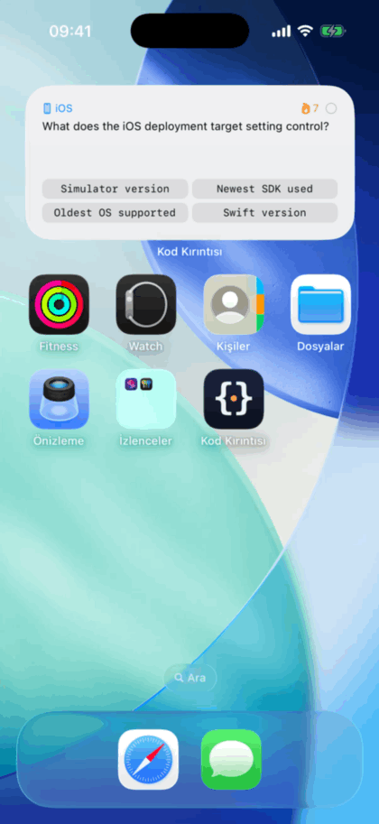
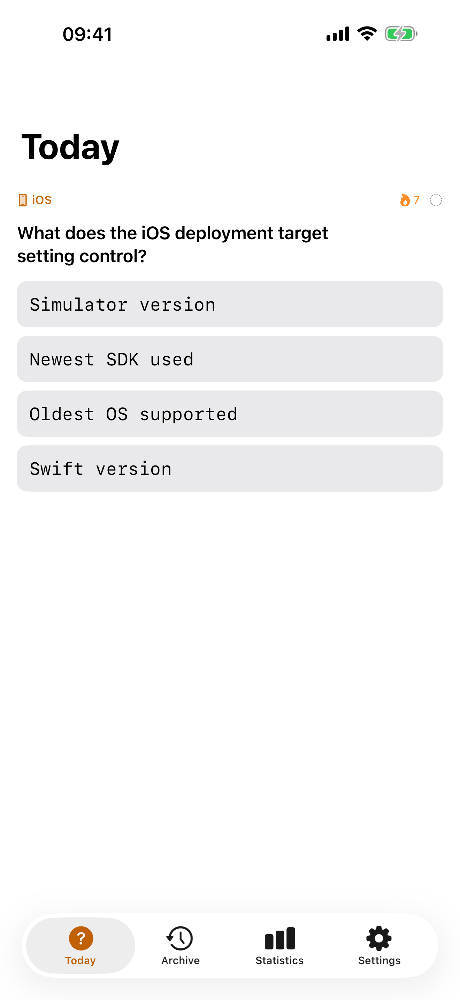
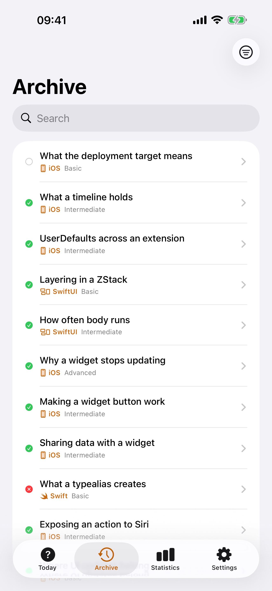
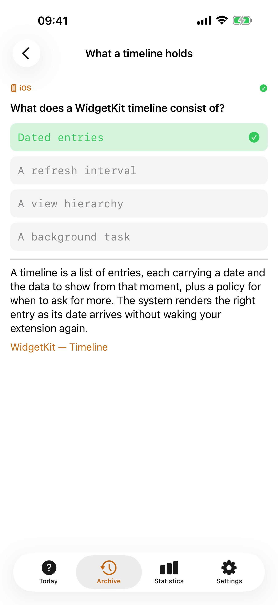
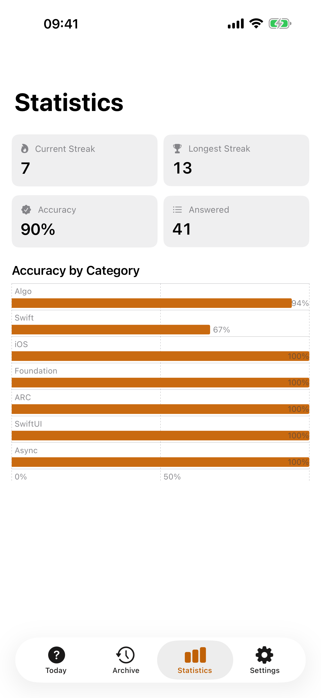
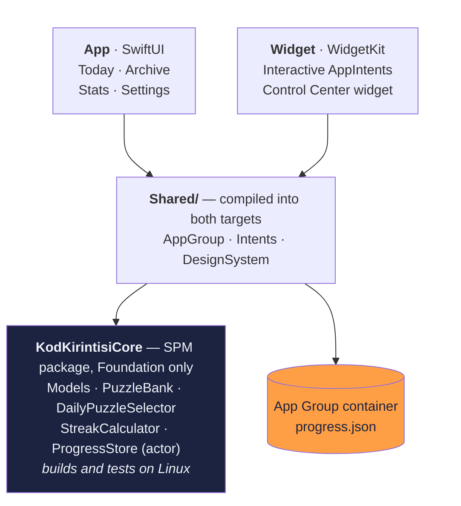

# Codestion

[](https://github.com/beratsmr/kod-kirintisi/actions/workflows/ci.yml)


**One Swift puzzle a day, on your Home Screen — no app launch required.**

Codestion puts a small Swift/algorithm question on your Home Screen every morning. You answer it with interactive widget buttons in about four seconds. Open the app only when you want the full explanation.

<!-- Regenerate with ./scripts/record-widget.sh, which writes docs/widget.gif. -->



| Today | Archive | Explanation | Statistics |
|---|---|---|---|
|  |  |  |  |

## Why

Daily practice apps fail because opening them is the hard part. This one removes that step: the content lives where you already look. Fully offline, no account, no tracking, no ads — the app contains no networking code at all, and [`docs/PRIVACY.md`](docs/PRIVACY.md) lists exactly what is stored and where.

## Architecture



Both processes read the same container and compute the day's puzzle independently — there is no scheduler process and no server to disagree with.

All business logic lives in a platform-independent SPM package, so the test suite runs on Linux CI in seconds and the UI layer stays thin. Details in [`docs/ARCHITECTURE.md`](docs/ARCHITECTURE.md).

**Notable decisions**

- The daily puzzle is chosen by a **pure, deterministic function** — a SplitMix64 permutation seeded per install and anchored to the install date, so the app and the widget compute the same answer independently with no shared scheduler and no backend.
- The bank is shuffled **in blocks of 30 rather than as a whole**, which is what makes it safe to grow. A single shuffle of the entire bank looked equivalent and was not: adding ten puzzles to a bank of 120 changed the puzzle on all 120 days users had already lived through.
- The Xcode project is **generated from `project.yml`** with XcodeGen and is not committed, so there are no `.pbxproj` merge conflicts and the project layout is reviewable.
- **Zero third-party dependencies.** Apple frameworks only.
- Swift 6 language mode with `strict concurrency = complete`.

## Getting started

```bash
brew install xcodegen swiftlint swiftformat

swift test --package-path Core   # core logic — no Xcode needed
xcodegen generate                # produces KodKirintisi.xcodeproj
open KodKirintisi.xcodeproj
```

Full environment notes (including how to develop this without Xcode installed): [`docs/SETUP.md`](docs/SETUP.md)

## Documentation

| Doc | Contents |
|---|---|
| [`docs/SPEC.md`](docs/SPEC.md) | Product spec, MVP scope, content model |
| [`docs/ARCHITECTURE.md`](docs/ARCHITECTURE.md) | Layers, data flow, key components, test strategy |
| [`docs/SETUP.md`](docs/SETUP.md) | Toolchain, editor, CI, troubleshooting |
| [`docs/puzzles.schema.json`](docs/puzzles.schema.json) | JSON Schema for the puzzle bank |
| [`docs/PRIVACY.md`](docs/PRIVACY.md) | Privacy policy (EN/TR) and the filed App Store Connect answers |
| [`CLAUDE.md`](CLAUDE.md) | Engineering rules and build milestones |

## Contributing puzzles

Puzzles live in `Core/Sources/KodKirintisiCore/Resources/puzzles.json` and are validated by `PuzzleBankIntegrityTests` in CI.

Two rules, both enforced by that suite, because the daily schedule is derived from index positions:

- **Append only.** Reordering or deleting changes which puzzle a user already saw on a given day.
- **Append in whole blocks of 30.** The schedule is shuffled one block at a time, so a release that leaves the last block half full and a later one that fills it would reorder the days inside it — for users who had already seen them.

## Scripts

Everything generated in this repo is generated by a committed script, so the output can be reviewed and reproduced rather than taken on trust.

| Script | What it does |
|---|---|
| [`scripts/run-simulator.sh`](scripts/run-simulator.sh) | Builds and launches the app on a simulator |
| [`scripts/make-app-icon.swift`](scripts/make-app-icon.swift) | Renders the app icon PNG with CoreGraphics |
| [`scripts/make-screenshots.sh`](scripts/make-screenshots.sh) | Captures the App Store screenshots by driving the real app |
| [`scripts/record-widget.sh`](scripts/record-widget.sh) | Records the Home Screen widget and writes the README GIF |
| [`scripts/movie-to-gif.swift`](scripts/movie-to-gif.swift) | Converts a screen recording to an animated GIF, no ffmpeg needed |

## License

MIT
